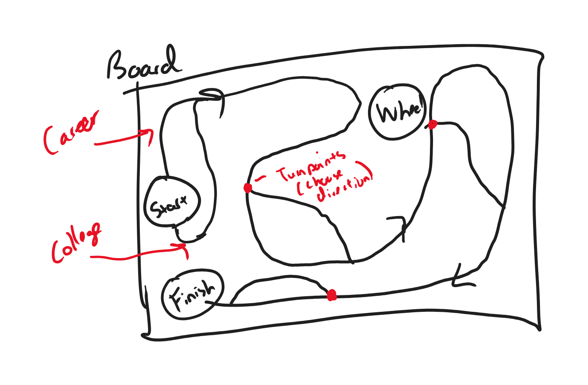

:warning: Everything between << >> needs to be replaced (remove << >> after replacing)

# The Road Trip
## CS110 Final Project   Spring, 2024 

## Team Members

*** Jeremy Luk

## Project Description

*** I want to create a 2D Game of Life board game where the user moves a character around a board and interacts with random events based on where they land and the amount of money they made will display at the end as the player's score.

## GUI Design

### Initial Design

### Final Design

## Program Design

### Features

1. Character moves around
2. Interactable Choices
3. Buttons as a roll mechanism
4. Score keeping and displaying score at end
5. Menu to keep playing or to quit

### Classes

- << You should have a list of each of your classes with a description >>

Controller:
- 

Initialize:
- 

Game:
- 

Movement:
- 
## ATP

| Step                 |Procedure             |Expected Results                   |
|----------------------|:--------------------:|----------------------------------:|
|  1                   | Run Counter Program  |GUI window appears with count = 0  |
|  2                   | click count button   | display changes to count = 1      |
etc...
